<div align="center">

# 📚 Smart Text Thief

### Intelligent SaaS platform for secure online exam creation and management

[](https://flutter.dev)
[](https://firebase.google.com)
[](https://ai.google.dev)

**An educational app focused solely on exams: creation, execution, monitoring, and analysis**

• [Setup](#-quick-setup) • [Screens](#-screens)

</div>

---

## 🎯 What Makes It Different

```
✓ Create exams quickly using artificial intelligence
✓ Simple and straightforward design without complexity
✓ Robust security system during exams
✓ Analytics that help improve assessment quality
```

**Goal:** Deliver a faster experience for teachers, a fair experience for students, and complete administrative control at the platform level.

---

## 👥 User Types

<table>
<tr>
<td width="33%" align="center">

### 👨‍🏫 Teacher

Create courses and exams, manage settings, track results

</td>
<td width="33%" align="center">

### 🎓 Student

Join courses, take exams, track results

</td>
<td width="33%" align="center">

### 👨‍💼 Admin

Manage the system, data, and users at the platform level

</td>
</tr>
</table>

> **Note:** The current app interface supports Teacher/Student selection for end users, while the Admin role exists within the scope of system and platform management.

---

## 👨‍🏫 Teacher Highlights

<details open>
<summary><b>📚 Courses & Exams</b></summary>

- ✅ Create educational subjects (Open / Closed)
- ✅ Create exams and link them to subjects
- ✅ Review and edit questions before first publication only
- ✅ Export exams as PDF

</details>

<details>
<summary><b>⚙️ Flexible Exam Settings</b></summary>

- 🎯 **Difficulty Level:** Easy / Medium / Hard
- ⏰ **Timing:** Start and end time
- 📝 **Questions:** Question types and quantities
- 📎 **Content:** Link exam to content (PDF / Image / Text)

</details>

<details>
<summary><b>📊 Analytics & Notifications</b></summary>

- 📈 Analytical dashboard to track student results and overall performance
- 🔔 Real-time notifications for important events within the course

</details>

---

## 🎓 Student Highlights

### 📚 Exam Experience

- ➕ Quick access to courses and exams
- ⏰ Take exams within the specified time
- 📊 View results according to exam policy

### 📝 Supported Question Types

| Type | Description |
|------|-------------|
| **MCQ** | Multiple choice questions |
| **True/False** | True or false questions |
| **Essay** | Essay questions |

### 🔐 Protection During Testing

```
🚫 Screenshot prevention on Android & iOS
⏱️ 2-minute grace period when exiting the app
⚠️ Automatic exam termination after grace period expires
```

---

## 👨‍💼 Admin Highlights

<div align="center">

| Area | Description |
|------|-------------|
| 👥 **Users** | Manage users and roles |
| 📚 **Content** | Manage subjects and exams |
| 📊 **Data** | Monitor platform-wide data |
| ⚙️ **Settings** | Control system settings and plans |

</div>

---

## 🔐 Security and Authentication

<div align="center">

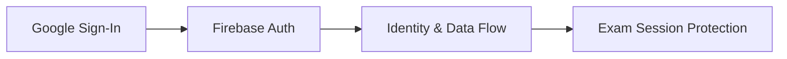

</div>

- 🔑 Login via **Google Sign-In**
- 🔥 Firebase-based identity and data flow
- 🛡️ Exam session protection to reduce cheating and leaks

---

## 🤖 AI Engine

<div align="center">

### Powered by **Gemini 2.5 Flash** ⚡

</div>

#### 🎯 Use Cases

- 💡 Support question generation from content
- 📝 Essay answer analysis

#### ⚙️ Flexibility

```yaml
Default Model: gemini-2.5-flash
Custom API: Support for user API Key (from profile)
```

---

## 💎 SaaS Plans

<table>
<tr>
<td width="50%" align="center">

### 🆓 Free Plan

**For Basic Use**

Limited features suitable for personal use

</td>
<td width="50%" align="center">

### 👑 Pro Plan

**For Professional Use**

All advanced features and full support

</td>
</tr>
</table>

---

## 🌐 Web Version

> **Landing Page Only**

<div align="center">

| Features | Description |
|----------|-------------|
| ℹ️ **Introduction** | Introduce the app |
| ✨ **Showcase** | Display features |
| 📱 **Conversion** | Direct users to download the app |

**❌ Does not include exam execution or Dashboard**

</div>

---

## 📱 Screens

<details open>
<summary><b>View All Screens (Click to Expand)</b></summary>

### 🎨 Authentication Flow

<table>
<tr>
<td width="33%" align="center">
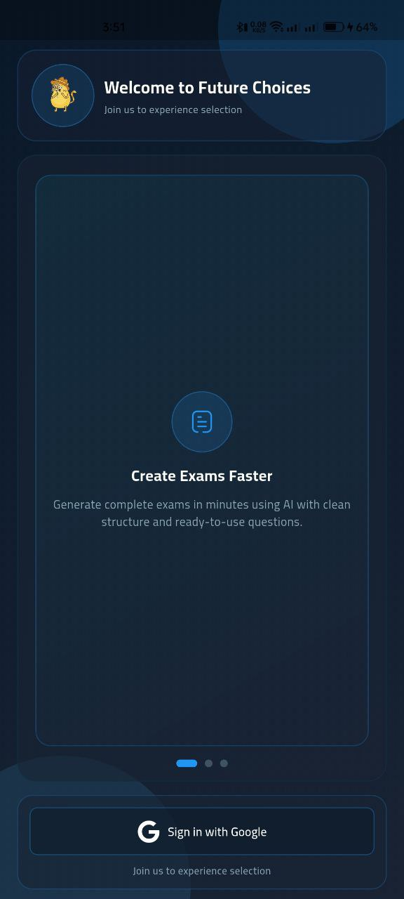
<br/><b>Login Screen 1</b>
</td>
<td width="33%" align="center">
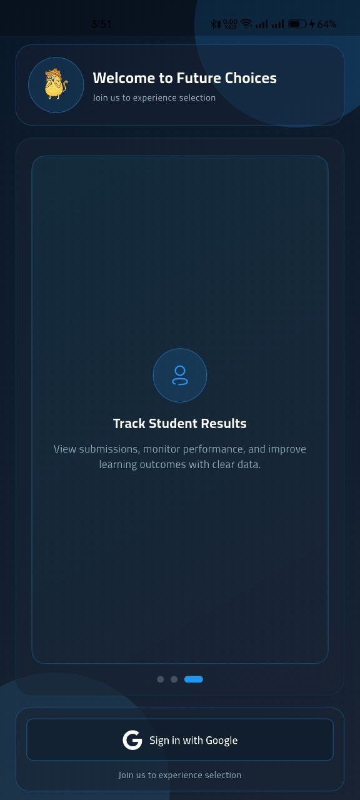
<br/><b>Login Screen 2</b>
</td>
<td width="33%" align="center">

<br/><b>Login Screen 3</b>
</td>
</tr>
<tr>
<td align="center" colspan="3">
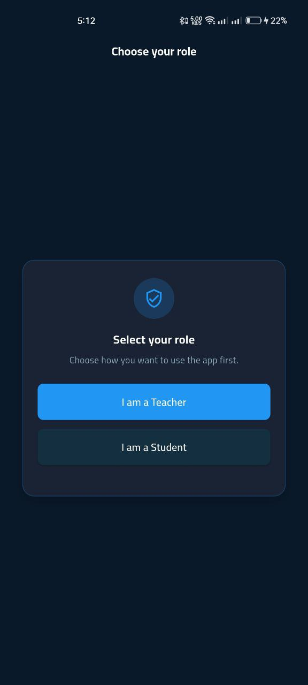
<br/><b>Choose Role</b>
</td>
</tr>
</table>

### 📚 Main Screens

<table>
<tr>
<td width="33%" align="center">
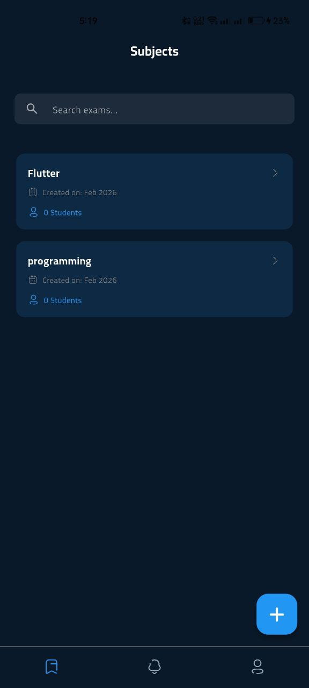
<br/><b>Subjects</b>
</td>
<td width="33%" align="center">
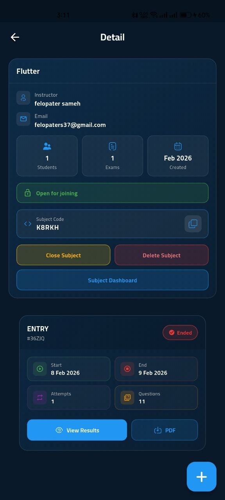
<br/><b>Subject Details</b>
</td>
<td width="33%" align="center">
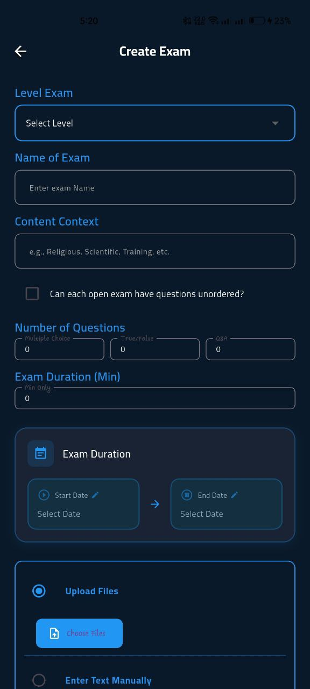
<br/><b>Create Exam</b>
</td>
</tr>
</table>

### 🎓 Exam Screens

<table>
<tr>
<td width="50%" align="center">
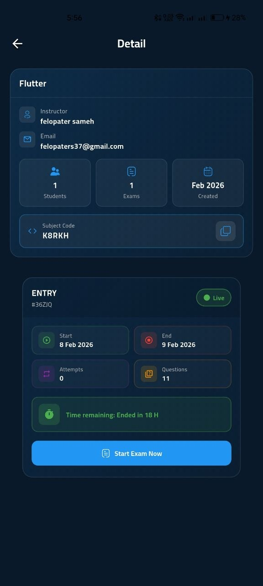
<br/><b>Take Exam</b>
</td>
<td width="50%" align="center">

<br/><b>Exam Result</b>
</td>
</tr>
</table>

### ⚙️ Common Screens

<table>
<tr>
<td width="33%" align="center">
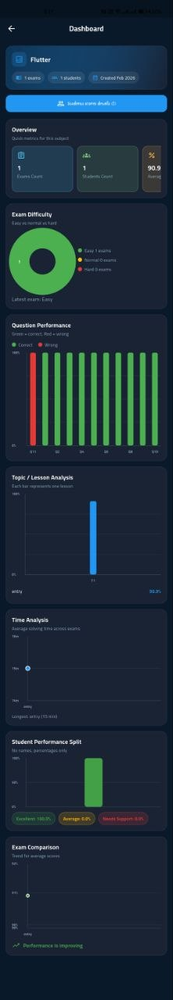
<br/><b>Dashboard</b>
</td>
<td width="33%" align="center">
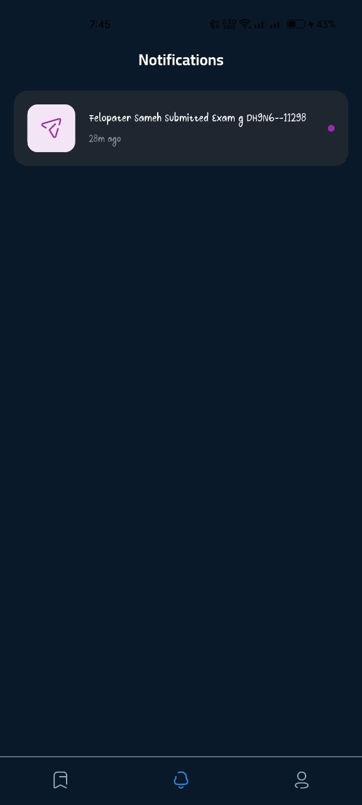
<br/><b>Notifications</b>
</td>
<td width="33%" align="center">
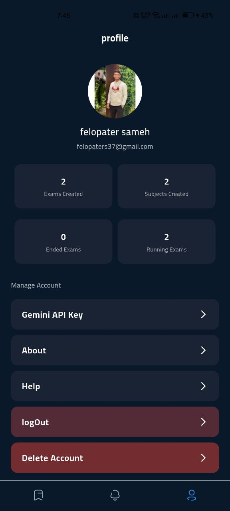
<br/><b>Profile</b>
</td>
</tr>
</table>

</details>

---

## 🛠️ Tech Stack

<div align="center">

### Frontend


### Backend & Services


### State Management


### AI & Tools


</div>

---

## 🚀 Quick Setup

### 1️⃣ Requirements

```bash
✓ Flutter 3.38.9 (stable) or compatible
✓ Dart 3.10.x
✓ Firebase project configured
```

### 2️⃣ Install dependencies

```bash
flutter pub get
```

### 3️⃣ Environment file

Copy `.env.example` to `.env` and fill in the values:

```env
GOOGLE_WEB_CLIENT_ID=
FCM_PROJECT_ID=
FCM_SERVICE_ACCOUNT_PATH=
GEMINI_FALLBACK_API_KEY=
```

### 4️⃣ Firebase files

<table>
<tr>
<td width="50%">

**Android**

```
android/app/google-services.json
```

</td>
<td width="50%">

**iOS**

```
ios/Runner/GoogleService-Info.plist
```

</td>
</tr>
</table>

**Generated options:**

```
lib/firebase_options.dart
```

### 5️⃣ Run

```bash
flutter run
```

---

## 📊 Project Status

<div align="center">

### ✅ Ready for Publish


</div>

#### ✔️ Completed

- ✅ All core features implemented
- ✅ Firebase integration complete
- ✅ AI engine integrated
- ✅ Security system active
- ✅ UI/UX finalized

#### 🔄 Remaining Work

- 🔧 Minor polishing
- 📱 Store assets finalization

---

<div align="center">

### ⭐ If you find this project helpful, please give it a star

**Made with ❤️ for Education**

---

[](#)
[](#)
[](#)

</div>
